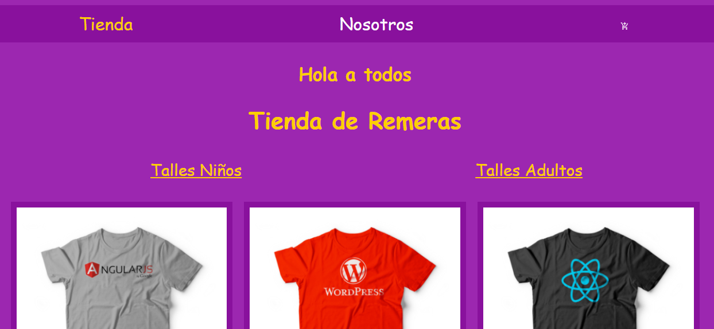
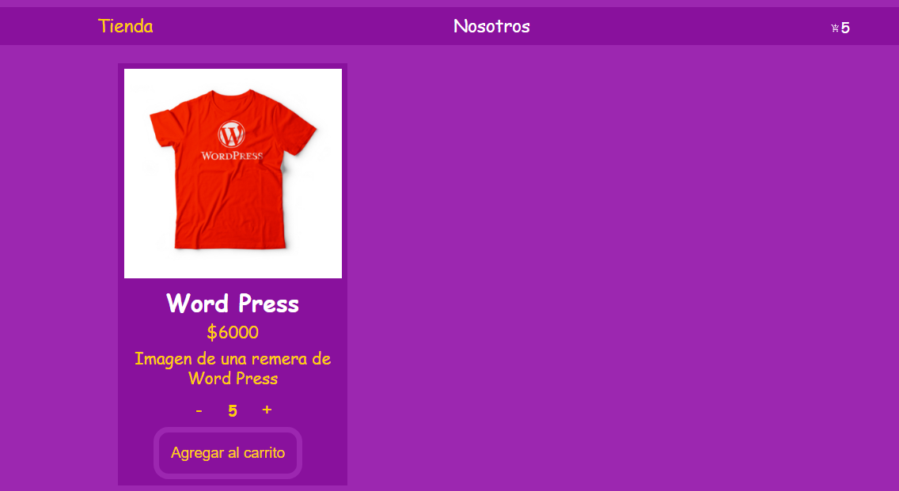
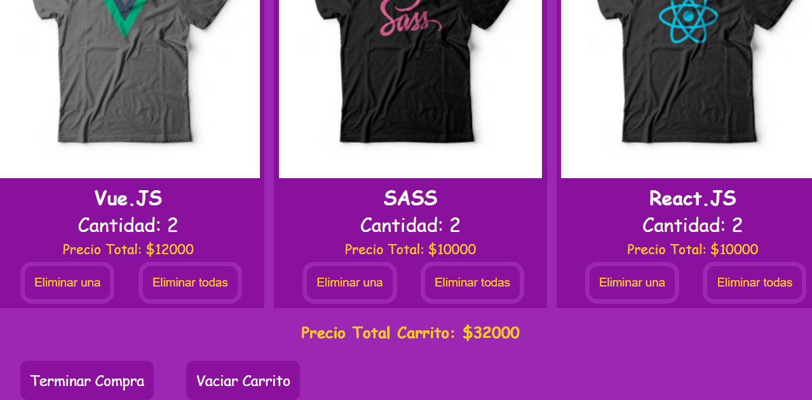
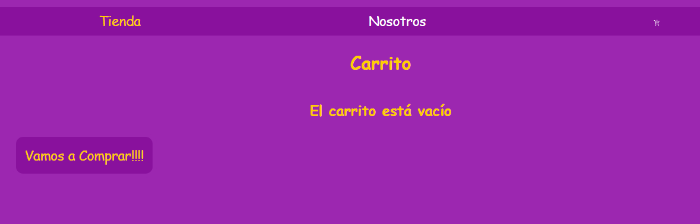
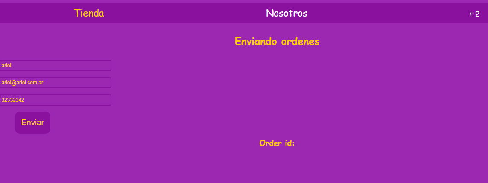
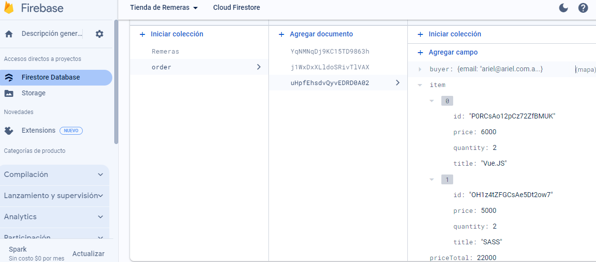

# Mi proyecto con React y create-react-app

## Este es mi proyecto para la comisión 49965 de Coderhouse

#### Es una página de un e-commerce de remeras

-----
* En este e-commerce creé una página principal donde están todas las remeras, con sus respectivos precios. 
En esta página puedo clickear en cada una de ellas o hacer un filtro por talle, ya sea de adulto o de niño.

* En el NavBar podemos elegir entre 3 páginas:
 
1. La misma tienda.
2. Una página nosotros (donde simulo contar la historia de la tienda y doy un par de tips sobre porque conviene comprar con nosotros).
3. Una imagen de un carrito de compras (el cual aparece vacío, pero al ir agregando items, nos va diciendo la cantidad que tenemos en el mismo).

----
Al clickear sobre cada remera nos lleva a otra página donde podemos seleccionar la cantidad de las mismas y al hacer click sobre el botón **agregar al carrito**, automáticamente se agrega esa cantidad al ícono del carrito.

------

Al seleccionar el carrito, nos lleva a la página del mismo y en ella podemos, eliminar de a **una remera**, **eliminarlas todas**, **vaciar el carrito** o **terminar nuestra compra**.

Si elegimos *vaciar el carrito o eliminamos todos los ítems*, nos muestra el carrito vacío y nos da la posibilidad de volver a la página de inicio.

Si *seleccionamos terminar compra* nos redirige a una página que es un formulario donde completamos unos datos y los mismos son almacenados en una base de datos que realizamos en ***Firebase***.

-----
En Firebase hay 2 colecciones:
* Una llamada **remeras** donde guardamos los ítems, con su *precio*, *cantidad en stock*, *talle*, *descripción*, *imagen* e *id* (la cual está guardada en el ***storage*** de Firebase).
* La otra llamada **order**, donde se guardan los datos del comprador, *nombre*, *email*, *teléfono* y donde además se le asigna un *id*.

